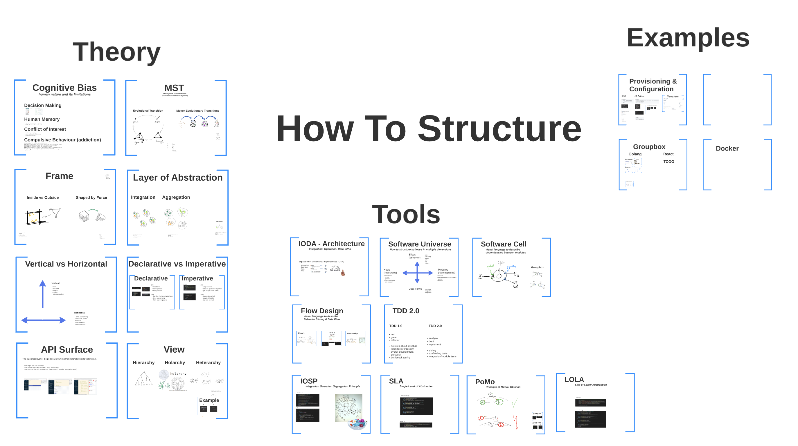
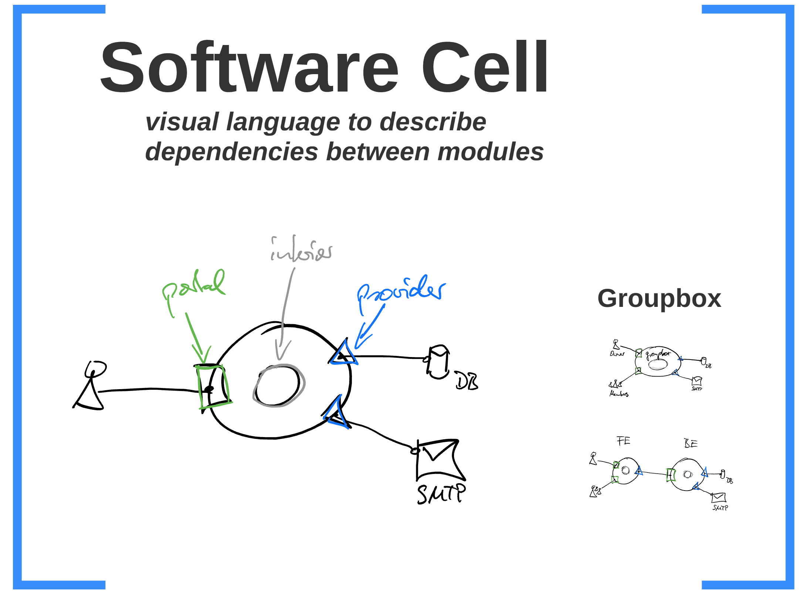
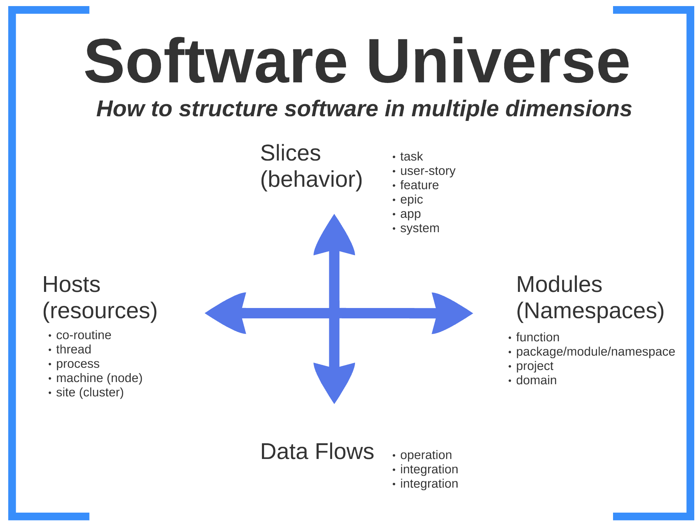
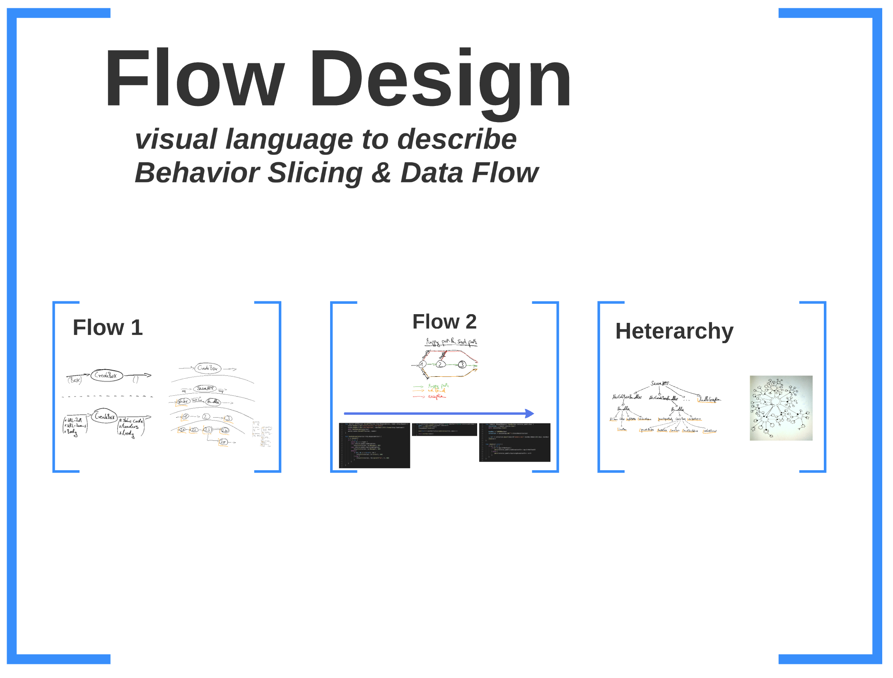
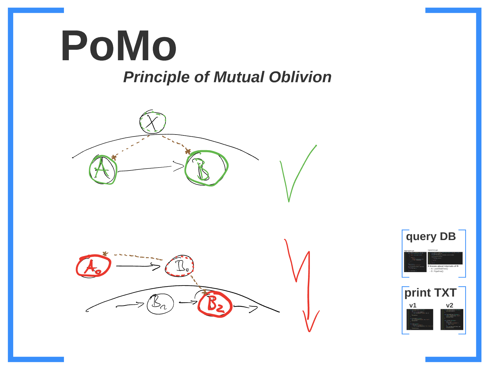
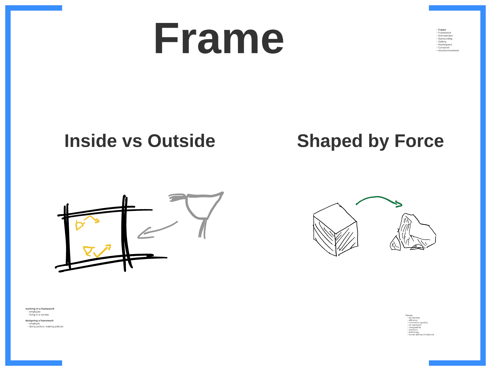
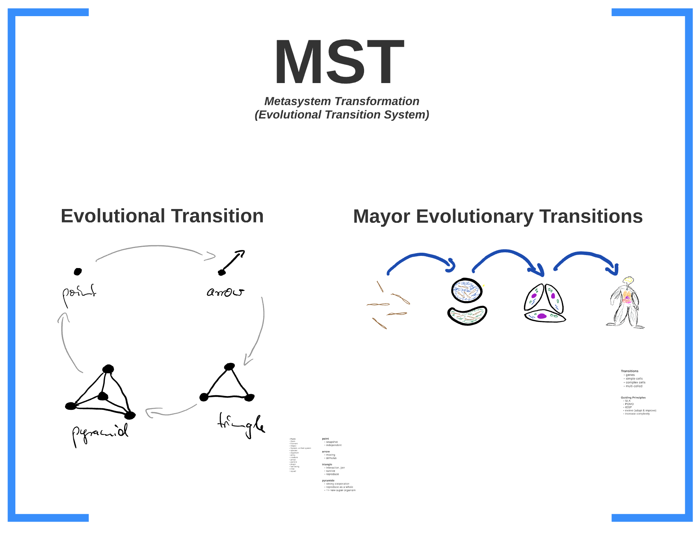
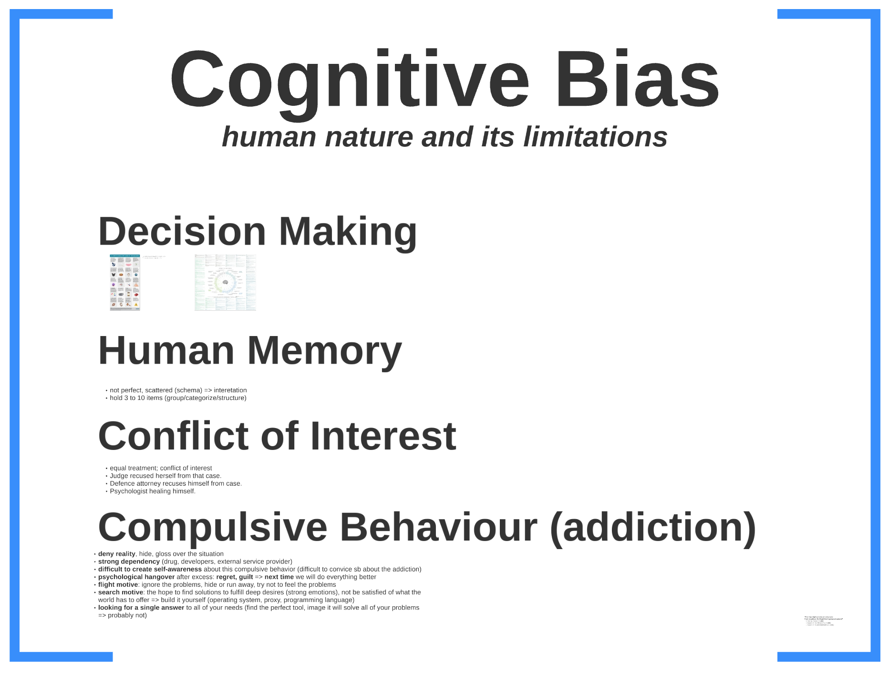
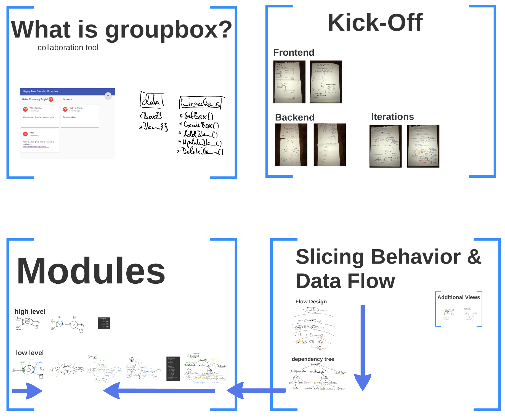

# How to structure

In project work I regularly find myself asking the following question: **How to structure Software.**

- How should I layout the file system of my project?
- How do you structure Golang projects or maybe React applications?
- In what structural way should microservices interact with each other?
- What about pods in Kubernetes?
- and on and on ...

These questions arise more than often among developers and can lead to heated discussions.

Is it even possible to come up with a perfect solution where everybody agrees on?

Maybe, but before that happens I set out on a mission to develop a common language that simplifies these discussions.

How about SLA (Single Level of Abstraction), DRY (Don't repeat yourself), WET (Write Everything Twice)? Do you like these abstractions?

I certainly do, because it helps to grab the bull by its horns.

After working as a contractor on many projects I could not stand to see the dirt we were producing day in and day out.

So I set out on a mission to define a common language to simplify discussions about "How to structure Software" and give the developers back their freedom to develop great application.

**Right now this is still "work in progress"!**

It takes time to get out of the rabbit hole and destill the most important concepts and present them in a meaningful way.

If you hear me talking about it it certainly makes more sense :-)

The screenshots are here to give you a first impression that "there is something bubbling beneath the surface".

For now just get inspired by my sketches and if you find there is something that resonates with you, please reach out to further this discussion, because I love that stuff :-)

## Links

Online presentation: http://prezi.com/tqm3fr_wd2nl

You can also download the presentation using the sources (portable version for mac and windows).

## Screenshots

